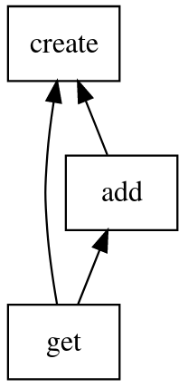

# Dependency management

## Resolution
  
_Algorithm_:

* read all relevant SQL files
* parse them for dependencies
* build a dependency graph
* sort graph topologically

## Visualization

_Example_:

```sql
--create.sql
CREATE TABLE tab (name TEXT PRIMARY KEY);

--add.sql
INSERT INTO tab (name) VALUES ('markus');

--get.sql
#import "add"
SELECT * FROM tab;
```

_Corresponding dependency graph_:


